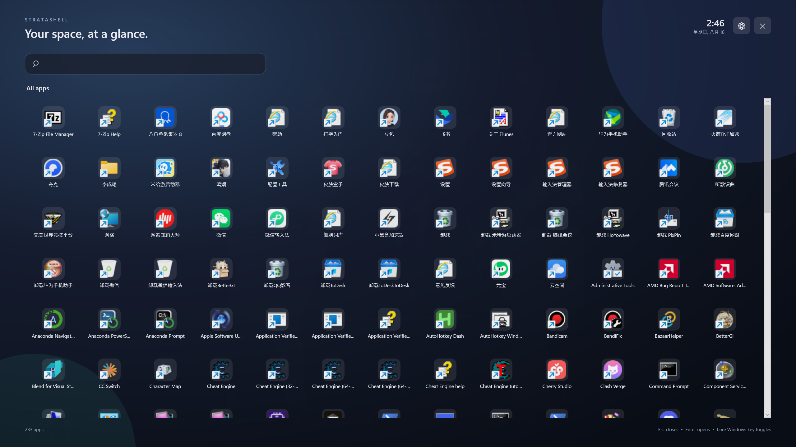
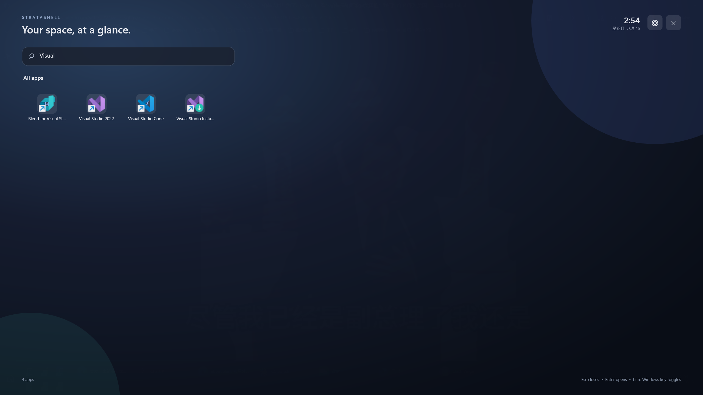
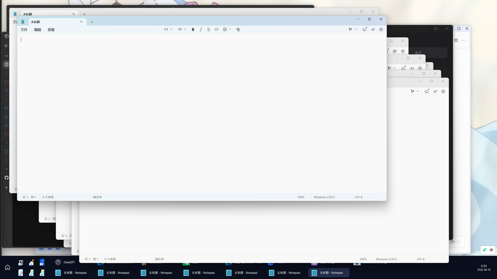
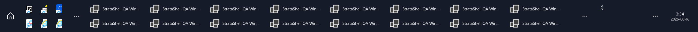

# StrataShell

StrataShell is an open-source Windows 11 shell companion: a genuinely
full-screen application panel plus a height-adjustable, multi-row taskbar.
It keeps Explorer as the recovery shell, requires no administrator rights,
and is licensed under MIT.




## What works in 0.1.1 preview

- Full physical-monitor panel with search, real Start-menu shortcuts and icons,
  keyboard navigation, launch, reduced motion, and quick-launch pin/unpin.
- Bare Windows-key interception that leaves Windows shortcuts fail-open.
- Configurable 48-180 px taskbar with 1-4 wrapping rows, quick launch, running
  windows, notification icons, clock, auto-hide, full-screen-app avoidance,
  and optional taskbars on every connected monitor.
- Settings window, tray controls, per-user sign-in startup, versioned atomic
  settings, diagnostics, safe reset, and restart.
- Separate crash watchdog that restores every Explorer taskbar if the custom
  taskbar process exits abnormally.







## Install

1. Install the [.NET 8 Desktop Runtime](https://dotnet.microsoft.com/download/dotnet/8.0)
   for x64. With `winget`: `winget install Microsoft.DotNet.DesktopRuntime.8`.
2. Download `StrataShell-0.1.1-win-x64.zip` and its `.sha256` file from Releases.
3. Verify the checksum, extract the entire directory, then run `StrataShell.exe`.
4. Test the panel first. Enable the custom taskbar only after reading the
   recovery note in Settings.

No installer or elevation is required. Keep the extracted files together;
the watchdog executable is mandatory when the custom taskbar is enabled.

## Recovery and uninstall

- Normal exit: tray icon -> **Exit StrataShell**. Explorer's taskbar is restored.
- If the main process crashes, the independent watchdog restores Explorer.
- Emergency recovery: open Task Manager with Ctrl+Shift+Esc, end StrataShell,
  then run `explorer.exe` if Windows has not already restored it.
- Disable **Run when I sign in**, exit, and delete the extracted directory.
  Per-user data is in `%LOCALAPPDATA%\StrataShell` and may be deleted separately.

## Current boundaries

This is a public preview, not yet the final compatibility release. The custom
taskbar is bottom-edge focused. Touch, high contrast,
screen readers, display hot-plug, sleep/resume, wider monitor/DPI combinations,
virtual desktops, attention/progress overlays, groups, and a clean-machine
uninstall matrix still need wider validation. The dark visual system is the
only supported theme in 0.1.1. Hardware Windows-key behavior should be verified
on each Windows feature build before enabling sign-in startup.

Two 2560x1440 monitors, including a 125% DPI secondary display, were exercised
locally for panel placement and simultaneous taskbars. Wider topology testing
is still required.

The application icon is maintained as the editable vector
[`assets/StrataShell.svg`](assets/StrataShell.svg); the Windows ICO and preview
are reproducibly generated by `scripts/build-icon.ps1`.

The detailed, evidence-linked state is in
[`docs/requirements/ACCEPTANCE.md`](docs/requirements/ACCEPTANCE.md) and
[`docs/qa/VALIDATION_REPORT.md`](docs/qa/VALIDATION_REPORT.md).

## Build and test

```powershell
dotnet restore StrataShell.sln
dotnet format StrataShell.sln --verify-no-changes
dotnet build StrataShell.sln -c Release --no-restore
dotnet test StrataShell.sln -c Release --no-build
powershell -ExecutionPolicy Bypass -File scripts/qa-accessibility.ps1 -NoBuild
powershell -ExecutionPolicy Bypass -File scripts/publish.ps1 -Version 0.1.1
```

The solution separates configuration/input policy, Windows integration,
presentation, watchdog, tests, and deterministic QA capture. See
[`docs/architecture/ADR-0001-architecture-selection.md`](docs/architecture/ADR-0001-architecture-selection.md).

## Upstream work and design direction

The implementation was informed by Start11's full-screen UX, Windhawk's open
taskbar experiments, and ManagedShell's Apache-2.0 shell abstractions. The
visual system combines Windows familiarity with Apple's emphasis on hierarchy,
restraint, spacing, and motion. Sources and license boundaries are documented
under [`docs/research/`](docs/research/) and in
[`THIRD_PARTY_NOTICES.md`](THIRD_PARTY_NOTICES.md).

Contributions and compatibility reports are welcome. Please read
[`CONTRIBUTING.md`](CONTRIBUTING.md) and [`SECURITY.md`](SECURITY.md).
